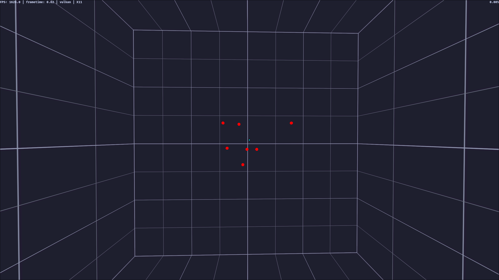
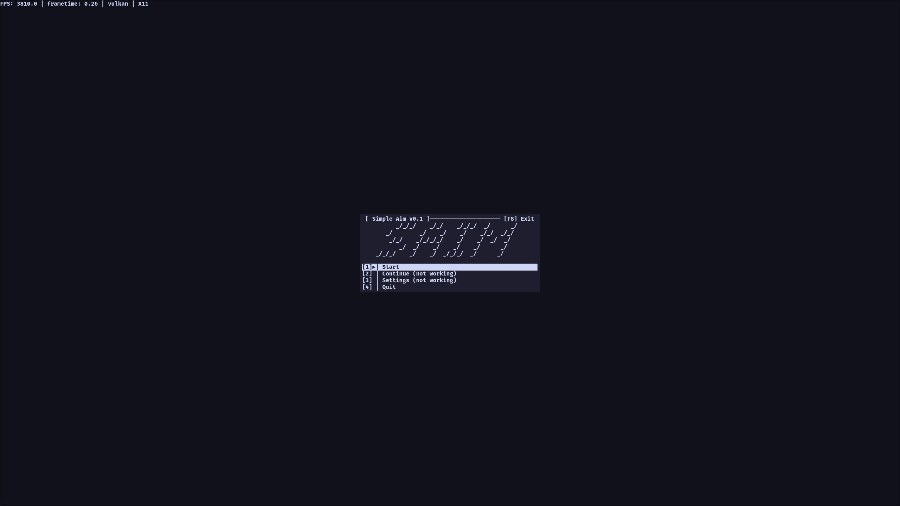

```                                          
      _/_/_/    _/_/    _/_/_/  _/      _/   
   _/        _/    _/    _/    _/_/  _/_/    
    _/_/    _/_/_/_/    _/    _/  _/  _/     
       _/  _/    _/    _/    _/      _/      
_/_/_/    _/    _/  _/_/_/  _/      _/       
                                
```
SAIM (Simple AIM) is an intentionally minimal aim trainer built around a few of my simple goals:

- All offline
- Portable binary
- Config done through transparent .ini files 
- High performance, low latency (2000fps on an average setup)
	+ Not necessarily because anyone needs 2000fps, but to be able to survive other processes hogging the resources
- Linux-native

## Features:

### Config through `.ini` files

I always hated running through settings menus, so all config is done in `.ini` files stored next to the binary. I perfer this system for making them easier to inspect, edit, back up and share

### Plugins system

The core is intentionally minimal, so you can add more onto it. Plugins currently are GDScript files, which are able to add any functionality godot engine supports. But proper scene imports are being worked on 

### High performance

Startup time, and performance, is a high priority for me, so you can run SAIM between rounds and such, I measure a 1 second startup time on an average system and 2000 fps. 

This is mainly so it can be run quickly and alongside games without being unusable


## Plans for the future:

- Being able to support custom scenarios through drag and drop
	+ Through the engine, relatively straightforward, just needs a bit of time
- Fully customisable everything
	+ Working on hit sounds, target/arena rendering etc.
- Better Wayland support on Linux
	+ Seems currently to be an issue with Godot's wayland
 implementation (?)
 
 ## Screenshots:
 



## Why?

I was never happy with any of the options for aim trainers right now, most are heavy, slow, and move away from the idea of simply training your aim. That's why I wanted to make one that was just simple, clean and fast

I just wated it to be: `open, pick a scenario, aim`